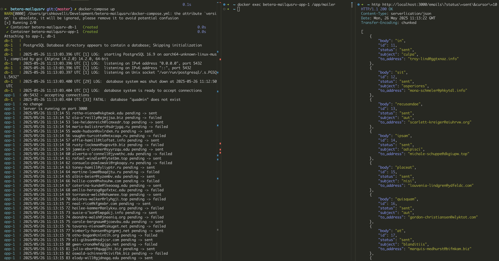

> Before launching Docker Compose, create a `.env` file using: `cp .env.example .env`

For local deployment, simply run `docker-compose up`. After execution, the database will be created and migrations will be performed.
Once both containers are running, to simulate sending messages, you can run the command `docker exec <APP_CONTAINER_NAME> /app/mailer` which
will create `50` requests with different email addresses.

Features:
  - Statistics of processed messages GET /emails?status = `pending` | `sent` | `failed`
  - PK-based pagination to reduce load GET /emails
  - Additional goroutine that checks for stuck messages (if worker crashed) in `processing` status and changes their status to `pending` for subsequent processing
  - Configuration via `.env`
  - Retry sending messages with `failed` status
  - Worker pool
  - Log output
  - Unit tests for `handlers` and `worker`
  - Docker + docker-compose
  - Graceful shutdown

To get statistics:

  ```
    # without pagination. Output up to 50 records (limited by SERVER_PAGE_SIZE)
    curl 'http://localhost:3000/emails?status=sent'

    # basic pagination by primary key
    curl 'http://localhost:3000/emails?status=sent&cursor=20'
  ```

For manual request sending:

  ```
    curl -H 'Content-Type: application/json' \
    -d '{ "to_address":"admin@mail.com","subject":"golang", "body": "Go probably the best language, u know?"}' \
    -X POST \
    http://localhost:3000/send-email
  ```

For testing run `go test ./internal/... -v`

ENV variables:

```
# Database server hostname or IP address.
DB_HOST=db

# The port number where the PostgreSQL database server is listening (default PostgreSQL port).
DB_PORT=5432

# Name of the database schema to connect to.
DB_NAME=mailqu

# Username for database authentication.
DB_USER=quadmin

# Password for the specified database user (Note: In production, use stronger credentials).
DB_PASSWORD=quadmin

# Disables SSL encryption for database connections.
DB_SSLMODE=disable

# The port number on which the application server will listen for incoming HTTP requests.
SERVER_PORT=3000

# Default number of items returned per page for paginated API responses.
SERVER_PAGE_SIZE=50

# Number of concurrent worker processes/threads that will process background jobs.
WORKER_POOL_SIZE=2

# Maximum number of tasks/jobs a single worker will process in one batch.
WORKER_BATCH_SIZE=10

# Interval (in minutes) at which the system checks for and recovers stuck worker tasks.
WORKER_STUCK_CHECK_INTERVAL=5
```


Demonstration of `docker-compose`, `mailer`, and `httpie`.

